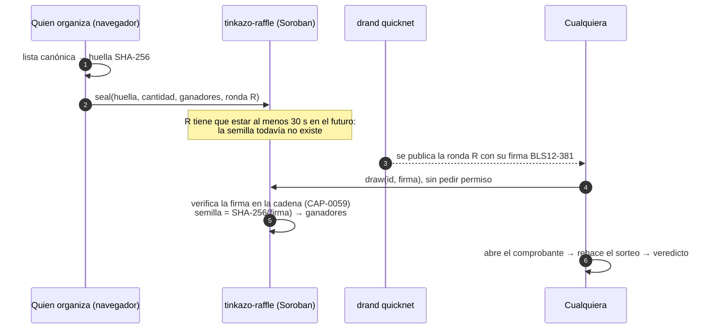
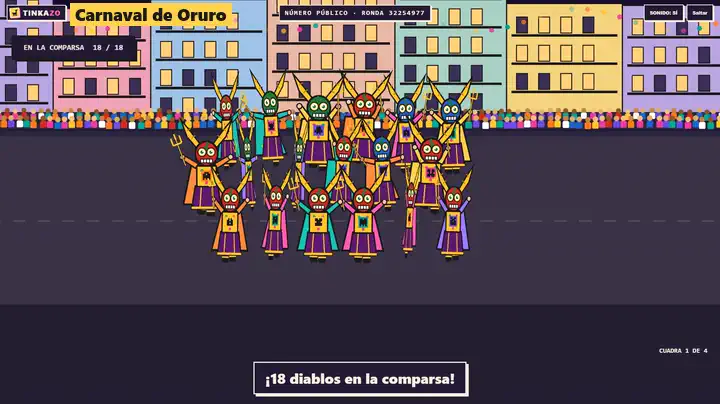

<div align="center">

# Tinkazo 🦙

### Sorteos verificables para comunidades, sellados antes de que exista el azar y comprobados en Stellar.

[](https://tinkazo.vercel.app)
[](https://stellar.expert/explorer/testnet/contract/CD2SSHBU37BSPCLNB2XMOGRL3CLUAURIJAJSG2CZVFZRDTURSIDARENH)
[](https://github.com/nema1502/tinkazo/actions/workflows/ci.yml)
[](https://drand.love)
[](LICENSE)

**[Probalo](https://tinkazo.vercel.app)** · [Cómo funciona](#cómo-funciona) · [Seguridad](#seguridad) · [Por qué Stellar](#por-qué-stellar) · [Qué está andando](#qué-está-andando-hoy) · [Los próximos 30 días](#los-próximos-30-días) · [English](README.md)


</div>

---

Toda comunidad regala cosas: entradas, libros, licencias, becas, turnos para hablar, quién expone primero. Y cada vez alguien en la sala piensa que el organizador eligió a un amigo. Lo que se usa hoy es un `ALEATORIO()` en una planilla, una ruleta en una página web o "confíen en mí". Nada de eso se puede revisar después.

**Tinkazo hace que cualquiera pueda revisar el sorteo, desde su celular.** Quien organiza pega la lista, la lista se sella en Stellar, y el ganador sale de un número público que todavía no existía cuando se selló. Un contrato de Soroban verifica la firma de ese número dentro de la cadena. El resultado se cuenta en pantalla grande con un juego, y cualquiera rehace el sorteo entero en su navegador desde un enlace.

Los participantes no necesitan nada: ni billetera, ni cuenta, ni aplicación.

El sorteo es por donde empieza. Para lo que existe Tinkazo es más amplio: que repartir entre la gente sea justo (un premio, un turno para exponer, una beca, un cupo en un viaje), y que cualquiera lo pueda comprobar desde su celular, sin saber que abajo hay una blockchain.

## No es de apuestas

Tinkazo decide quién se lleva algo que ya se está regalando. No sirve para apostar ni para vender chances:

- **Participar es gratis, siempre.** No hay boletos ni entrada paga. Los [términos](https://tinkazo.vercel.app/terminos.html) prohíben usar Tinkazo para sorteos que cobren por participar.
- **Nadie puede apostar al resultado.** No hay cuotas ni pozo: nadie pone plata, así que nadie gana la plata de otro.
- **El contrato no guarda fondos.** Guarda la huella de la lista y el resultado, nada más.

Un sorteo gratuito, sin compra obligatoria, queda fuera de las reglas de juegos de azar en casi todo el mundo; la investigación país por país está en [docs/legal.md](docs/legal.md). Algunos identificadores del contrato todavía dicen *raffle* (`tinkazo-raffle`, `raffle_id`), de antes de que el nombre se asentara. Son parte de la interfaz del contrato desplegado, así que quedan como están.

## Cómo funciona



1. **Sellar.** La lista se normaliza y se resume con SHA-256. El contrato anota la huella, la cantidad de personas, cuántos ganan y una ronda **futura** de drand, y rechaza una ronda a menos de treinta segundos.
2. **Esperar el número.** [drand](https://drand.love) quicknet, el faro público de aleatoriedad de la League of Entropy (Cloudflare, Protocol Labs, la EPFL y otros), publica una ronda firmada cada tres segundos. Nadie, ni quien organiza ni Tinkazo, puede conocerla ni elegirla antes.
3. **Sortear.** `draw` verifica la firma BLS12-381 de la ronda **dentro del contrato**, deriva la semilla y elige a los ganadores de forma determinista. No le pide permiso a nadie: si quien organiza desaparece en medio del evento, cualquiera lo finaliza y el ganador es el mismo.
4. **El show.** Uno de doce juegos a pantalla completa cuenta el resultado. Cuando arranca la animación, el ganador ya está fijado: el juego solo lo relata.
5. **Revisar.** El comprobante es un enlace. Quien lo abre ve a la página rehacer el sorteo desde cero y recibe un veredicto: verde si el contrato atestigua la lista, amarillo si el sorteo no se ancló, rojo con el motivo si algo no cuadra.

La selección completa es una especificación normativa, el [protocolo v2](docs/protocolo.md), con vectores de prueba que comparten el contrato en Rust y el cliente en TypeScript ([docs/vectors.json](docs/vectors.json)). Cualquiera puede reimplementarlo y llegar a los mismos ganadores.

## Por qué Stellar

- **Verificar azar público en la cadena acá es barato.** Las funciones nativas de BLS12-381 ([CAP-0059](https://github.com/stellar/stellar-protocol/blob/master/core/cap-0059.md)) dejan que el contrato compruebe la firma de drand por su cuenta. La verificación cuesta **0,003 XLM**; un sorteo entero, sellar más sortear, **0,76 XLM, unos 16 centavos de dólar**, medido en testnet el 3 de octubre de 2026, y casi todo es renta de almacenamiento ([detalle](docs/deployments.md)).
- **Sin oráculo que operar.** La prueba es la firma del propio drand, verificable contra su clave pública dentro de años. No hay nodo que mantener vivo ni operador en quien confiar.
- **Inmutable y sin custodia.** El contrato no tiene administrador ni forma de actualizarse, y no guarda fondos. Una versión nueva es una dirección nueva, anotada en [docs/deployments.md](docs/deployments.md).
- **Entrar funciona en un meetup.** Quien organiza entra con Google mediante Pollar, que guarda la llave de su cuenta (el recorrido con una sesión real de Google todavía se está probando), con Freighter, o con una cuenta de prueba que el navegador crea y fondea. Los participantes no tocan Stellar nunca.
- **Lo que sigue es nativo de Stellar:** recompensas y becas en USDC que pone quien organiza y que la persona elegida cobra como saldo reclamable, entrando con Google ([diseño](docs/premios.md)). Los participantes no pagan nada y Tinkazo nunca toca la plata, así que no hay pozo ni nada que apostar.

## Qué está andando hoy

| Pieza | Estado | Evidencia |
|---|---|---|
| Contrato Soroban `tinkazo-raffle` | Desplegado en testnet, que Stellar borra entera el 16 de diciembre de 2026 | [`CD2SSHBU…ARENH`](https://stellar.expert/explorer/testnet/contract/CD2SSHBU37BSPCLNB2XMOGRL3CLUAURIJAJSG2CZVFZRDTURSIDARENH) · 19 tests, uno con una ronda real de quicknet · WASM de 11,4 KB |
| Sitio | En producción | [tinkazo.vercel.app](https://tinkazo.vercel.app) · español e inglés · tema claro y oscuro · sin servidor |
| Importar de Luma | En producción | Se suelta el export de invitados y se elige quién entra: los que hicieron check-in, los aprobados o a mano |
| Página de verificación | En producción | Rehace cualquier sorteo en el navegador desde su comprobante |
| Doce juegos de estadio | En producción | Deterministas: la misma ronda dibuja los mismos cuadros en cualquier máquina |
| Protocolo v2 | Especificado | [docs/protocolo.md](docs/protocolo.md) y vectores que las dos implementaciones tienen que pasar |
| Controles de calidad | En la CI y en el repositorio | 196 tests de TypeScript, los 19 del contrato y siete auditores propios (abajo) |

Probado con mil participantes: el sorteo sigue a sesenta cuadros por segundo y se ancla igual.

**Quién estaba de verdad en la sala.** En el primer export real de Luma que probamos se habían inscrito 67 personas y hicieron check-in 35. Sortear con el export entero le daba la mitad de las chances a gente que no estaba. La ventana de importar propone a los que hicieron check-in, dice quién queda afuera y por qué (no vino, pendiente, invitado, rechazado) y deja marcar a alguien que vino y nunca le hicieron check-in. El archivo no sale del navegador, y al sorteo entran solo los nombres.

<div align="center">

</div>

<div align="center">

</div>

## El show

La justicia es matemática; el show es lo que hace que a la sala le importe. Doce juegos, casi todos de la cultura boliviana y latinoamericana, sembrados con la misma ronda de drand, así que la animación de un sorteo se puede reproducir:

| Juego | Qué es |
|---|---|
| Constelación Stellar | Un pago salta de estrella en estrella buscando ruta, como un *path payment*, y deja dibujada una constelación |
| Carrera de llamas | Ocho carriles por la cordillera |
| Luz roja, luz verde | El juego de patio: con verde se corre, con roja el Faro se da vuelta y barre la cancha con su haz, y al que ve moviéndose se sienta |
| Aguayo | La tela andina que carga: el bulto de cada uno va encima, la tela se cierra y se amarra, y el que queda se va en el nudo |
| Teleférico | Cabinas con los colores de las líneas de La Paz y El Alto suben por el cable; en cada estación se baja la mitad |
| Tómbola | El bombo de la kermés, una bola numerada por persona de la lista sellada |
| Ruleta | La de siempre, que se ve bien hasta con dos personas |
| Trompo | El juego de patio: los trompos se tiran al ruedo de tiza, chocan y se sacan hasta el mano a mano |
| Piñata | La estrella de siete picos de las posadas: con cada palo caen nombres, y gana el último caramelo que quedaba adentro |
| Carnaval de Oruro | Una comparsa de la Diablada baila cuadra por cuadra hacia el Socavón; en cada arco se quedan algunos |
| Sapo | El de las ferias y los patios: un agujero con cada nombre alrededor de la rana; las argollas pegan, bailan en el borde y salen, y la última entra en el de quien gana |
| ¿Quién es? | Todos en cartas; en cada turno una letra da vuelta a los que no coinciden, hasta que queda una |

**Ninguno decide nada.** Un *director de emoción* escribe la historia de cada sorteo con la misma ronda: en la carrera una llama se planta, otra tropieza y dos se escupen; la ruleta se para en otro nombre y después avanza un gajo; en el teleférico se corta la luz en el aire. El final no se adivina, y un auditor comprueba en dieciséis semillas por juego que la historia no delata al ganador.

Un director de cámara filma cada juego como una transmisión: sigue a la punta, se mete en el susto, va en cámara lenta en la foto final y sacude en los choques. Los juegos corren en PixiJS, y en un equipo sin WebGL toma la posta el motor anterior: el sorteo nunca se queda en blanco.

De fondo suena música andina con beat que sigue la tensión, unos subtítulos cortos cuentan cada momento en pantalla, y después del ganador una tarjeta cuenta un pedazo de la historia con su fuente primaria.

## Seguridad

> **El número que decide el sorteo no existe cuando se cierra la lista, y un contrato en Stellar lo verifica.** Lo que queda abierto no es tecnología, es gente: por eso todo se muestra antes de que ese número exista.

**Lo que está cerrado**

| Riesgo | Por qué no pasa |
|---|---|
| Elegir el número ganador | La ronda se fija antes de que exista, al menos treinta segundos en el futuro, y su firma se verifica en la cadena |
| Cambiar la lista después de sellar | Cambia la huella, y la que vale quedó anotada antes de la semilla |
| Retener un resultado que no gustó | `draw` no pide permiso: cualquiera lo finaliza y el ganador es el mismo |
| Sortear dos veces | El contrato guarda el primer resultado y rechaza otro |
| Que el juego muestre otro ganador | Los juegos reciben el ganador ya decidido, y un auditor lo comprueba en los doce |
| Tomar el contrato | No tiene administrador, no se actualiza y no guarda fondos |

**Lo que queda abierto, y lo que hay contra eso**

| Riesgo | Lo que hay |
|---|---|
| **Armar mal la lista** antes de sellar: un nombre dos veces, alguien que falta | "Mostrar la lista a la sala": la lista en el proyector con los repetidos marcados y un QR para que cada uno se busque en su celular. El comprobante también tiene el buscador, y la importación de Luma propone solo a los que hicieron check-in |
| **Sellar varias veces** y publicar el resultado que convino | El número del sorteo se muestra bien grande durante la espera, para que quede en las fotos. La verificación marca los sellos repetidos de la cuenta y la misma lista sellada desde otra |
| **Un sitio falso** en el proyector | Lo que vale es el contrato, y un sitio falso no puede escribir ahí. El sorteo se puede comprobar en stellar.expert y con la ronda pública de drand, [sin pasar por Tinkazo](https://tinkazo.vercel.app/como-funciona.html#sin-nosotros) |

Para mainnet: un solo sorteo abierto por cuenta, la cancelación pública, la ronda que pone el contrato y la lista ordenada en el protocolo. El análisis completo, con el método STRIDE, está en [docs/amenazas.md](docs/amenazas.md), y la versión para todo público en la [página de seguridad](https://tinkazo.vercel.app/seguridad.html).

**Privacidad.** En la cadena va solo la huella, nunca los nombres. El comprobante viaja en el fragmento de la URL, que el navegador no le manda a ningún servidor.

## Cómo se compara

El azar de drand en Stellar ya lo resolvió más de un proyecto, y vale nombrarlos:

| | Planilla o ruleta web | [Stellar-VRF](https://github.com/NibrasD/Stellar-VRF) | [Drand-Relay](https://github.com/kaankacar/Drand-Relay) | Tinkazo |
|---|---|---|---|---|
| Qué es | Un botón | Un oráculo: un contrato pide y un nodo de afuera entrega la ronda | Un relé que sube las rondas de drand y un contrato que las verifica | Un sorteo para quien organiza y una sala |
| Quién puede revisar | Nadie | Cualquiera que lea la cadena | Cualquiera que lea la cadena | Cualquiera con el enlace, desde el celular |
| Qué hay que operar | Nada | El nodo del oráculo | El que sube las rondas | Nada: el navegador arma la transacción |
| Para quién | Cualquiera, sin prueba | Otros contratos | Otros contratos | Gente que regala cosas |

Los tres verifican la firma BLS de drand quicknet en la cadena con CAP-0059. Stellar-VRF y Drand-Relay son primitivas para otros contratos, y buenas. Tinkazo es el producto para la gente, encima de la misma idea: una lista comprometida antes de que exista la semilla, un `draw` que cualquiera puede disparar y una página de prueba que corre en el celular. Fuera de la cadena, [Wallop](https://wallop.run) hace compromiso y drand para sorteos sin un ledger.

Por eso Tinkazo no publica otro crate verificador más. Su comprobación en la cadena, [`drand.rs`](contracts/raffle/src/drand.rs), son 112 líneas; lo que el ecosistema está pidiendo es una guía que compare los enfoques ([stellar-docs#2874](https://github.com/stellar/stellar-docs/issues/2874)), y eso está en el plan de abajo.

## Qué cuesta

Medido en testnet el 3 de octubre de 2026, no estimado: lo que cobró la red según Horizon. XLM a US$ 0,215.

| | XLM | US$ |
|---|---|---|
| Sellar un sorteo | 0,42 | 0,090 |
| Sortear, con la verificación BLS | 0,34 | 0,074 |
| **Total por sorteo** | **0,76** | **0,16** |
| Mainnet: desplegar una vez (proyección del 16 de septiembre) | unos 16 | unos 3 |
| Mainnet: mantener vivo el contrato (ídem) | unos 49 al año | unos 10 al año |

Casi todo el costo es alquiler de almacenamiento, y esa tarifa la pone la red: el 16 de septiembre el mismo contrato pagaba 0,18 XLM por sorteo, y en tres semanas la renta de testnet la multiplicó por cuatro. La verificación BLS en sí cuesta 0,003 XLM. En mainnet se mide al desplegar. **Verificar es gratis siempre.**

## Calidad

Siete auditores en [`scripts/`](scripts) corren el sitio de verdad en Chrome sin interfaz:

- **El de juegos**, veinte comprobaciones por juego contra drand de verdad. La que importa: el nombre en pantalla es el que fijó el protocolo.
- **El exigente**, que cambia el reloj del navegador para comparar dos corridas cuadro contra cuadro: la misma ronda dibuja lo mismo, ni un `Math.random`, nunca cuatro segundos sin novedad, el cartel del ganador se lee desde el fondo de la sala, con dos personas y con doscientas, en un celular.
- **El de emoción**, dieciséis semillas por juego: los arcos de la historia varían y el puesto de la ganadora a mitad de carrera no la delata.
- **El de sonido**, que engancha cada oscilador y mide afinación, registro, volumen y silencios de los efectos, con la música contada aparte.
- **El de interfaz**, en escritorio y celular, en los dos temas: imágenes rotas, texto cortado, contraste y blancos de toque.
- **El de física**, para la tómbola y el aguayo: nadie encimado, nadie se escapa, y la misma ronda da los mismos rebotes.
- **El de choques**, para el trompo: cada golpe toca de verdad, con acción y reacción, y nadie atraviesa a nadie.

## Los próximos 30 días

Cuatro entregables, cada uno con una comprobación que cualquiera puede hacer desde afuera:

| Entregable | Está hecho cuando |
|---|---|
| Mainnet, con la comisión pagada y el contrato verificado (`pnpm preflight:mainnet` ya comprueba lo demás) | El contrato figura verificado en stellar.expert, y alguien que entró con Google, con 0 XLM, sella y sortea un sorteo que da verde |
| Cinco sorteos reales, al menos tres hechos por otra persona con su propia cuenta | Cinco enlaces de comprobación en verde en mainnet, cinco direcciones de organizador y un comentario corto de cada uno |
| Un kit para organizadores, en español y en inglés | Una guía de una página, las bases generadas y un texto de resultado para Luma con la prueba de cada participante, enlazados desde el sitio |
| Aleatoriedad en Soroban, tres enfoques medidos | Un documento que compara [Drand-Relay](https://github.com/kaankacar/Drand-Relay), [Stellar-VRF](https://github.com/NibrasD/Stellar-VRF) y la verificación a pedido de Tinkazo (costo, en qué hay que confiar, un contrato de ejemplo), ofrecido a [stellar-docs#2874](https://github.com/stellar/stellar-docs/issues/2874) |

Después: recompensas en USDC como saldos reclamables, que pone quien organiza y que se cobran entrando con Google, primero en testnet. Los participantes siguen sin pagar nada, y Tinkazo nunca toca la plata.

## Correr en local

```bash
pnpm install
pnpm dev          # http://localhost:5173
pnpm test         # protocolo v2 contra los vectores compartidos
pnpm build
```

El contrato necesita Rust con el target `wasm32v1-none`:

```bash
cargo test --workspace
cargo build --release --target wasm32v1-none -p tinkazo-raffle
```

Parámetros de URL útiles: `?lang=en`, `?theme=light|dark`, `?demo=race|luz|trompo|pinata|oruro|tombola|wheel|teleferico|pasanaku|stellar|sapo|quien`, `?instant=1`, `?pose=1` y `?motor=clasico` (el motor anterior).

## El repositorio

```
index.html · verificar.html     La portada y la herramienta, y la página que rehace un sorteo desde su comprobante
lista.html                      La lista para revisar antes de sellar, en el celular de cada uno
src/protocol/                   Lista canónica, selección, drand, comprobante
src/stellar/                    Red, billeteras y cliente del contrato
src/games/                      Los doce juegos y el andamiaje que comparten
contracts/raffle/               El contrato Soroban, en Rust
docs/                           Protocolo, arquitectura, amenazas, despliegues, legal, juegos
scripts/                        Despliegue, prueba de humo y los auditores
```

Documentación: [protocolo](docs/protocolo.md) · [arquitectura](docs/architecture.md) · [amenazas](docs/amenazas.md) · [despliegues y costos](docs/deployments.md) · [juegos](docs/juegos.md) · [legal](docs/legal.md) · [marca](docs/marca.md).

## Quién lo hace

Hecho en Bolivia por [Nicolás Emir Mejía Agreda](https://github.com/nema1502). El nombre es boliviano: un *tinkazo* es un presentimiento, una corazonada.

## Contribuir

Issues y pull requests son bienvenidos. **Si encontrás una forma de torcer un sorteo, abrí un issue**: es el reporte que más sirve. Para agregar un juego, mirá [docs/juegos.md](docs/juegos.md); tiene que pasar los auditores para entrar.

## Licencia

[MIT](LICENSE) © 2026 Nicolás Emir Mejía Agreda
