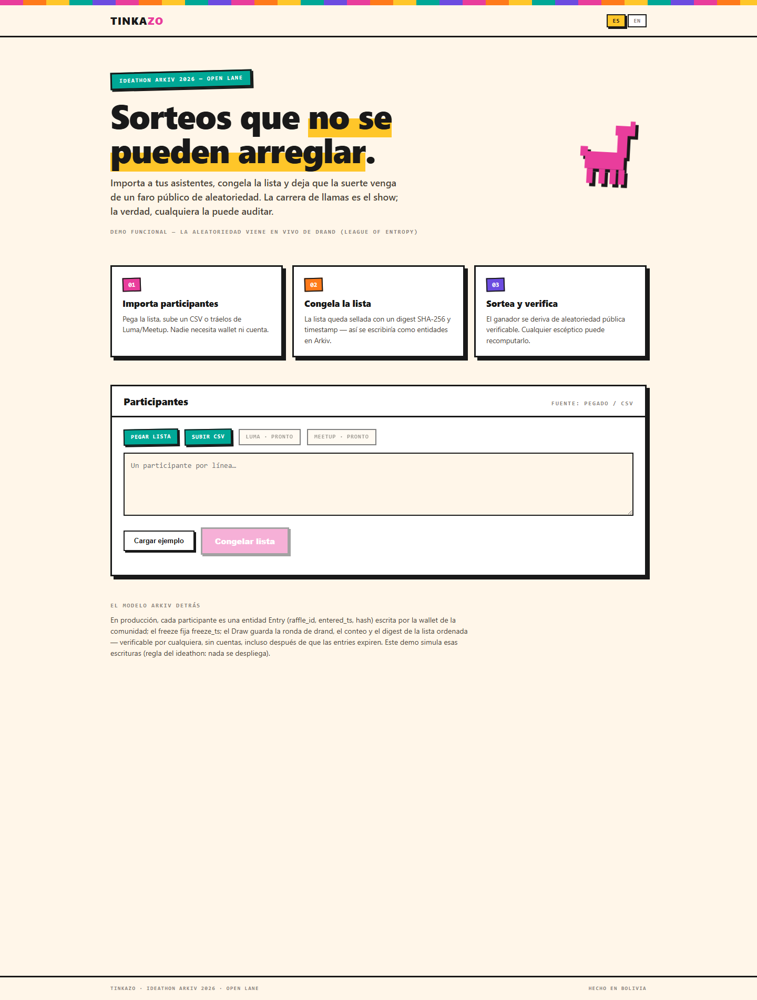
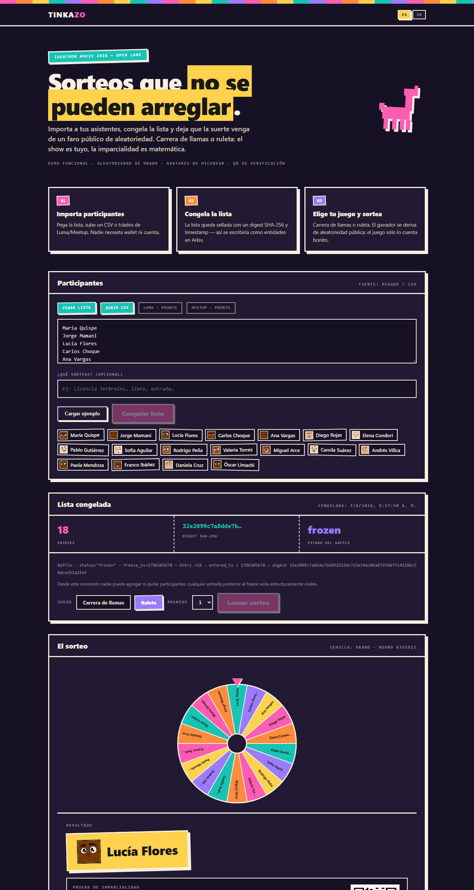
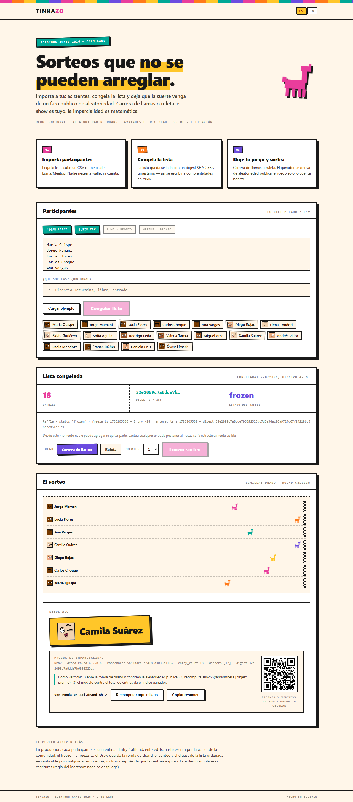

# Tinkazo 🦙

**Sorteos que no se pueden arreglar.**

En Bolivia, un *tinkazo* es esa corazonada de que hoy tienes suerte. Tinkazo es una plataforma de sorteos para comunidades donde la suerte es divertida de ver (carrera de llamas, ruleta) e imposible de manipular: la lista de participantes se sella antes del sorteo y la aleatoriedad viene de un faro público que nadie controla.

🌐 **Demo en vivo:** [tinkazo.vercel.app](https://tinkazo.vercel.app)


## Cómo funciona

1. **Cargás la lista.** Pegás nombres o subís un CSV. Los participantes no necesitan cuenta ni wallet.
2. **Se sella la lista.** El navegador calcula el SHA-256 de la lista ordenada. Ese hash es el compromiso público: después de sellar, nadie puede agregar ni quitar gente sin que se note.
3. **Llega la semilla.** La aleatoriedad la aporta [drand](https://drand.love) (League of Entropy), un faro público y verificable. Ni el organizador ni Tinkazo pueden elegirla.
4. **El show.** El resultado ya está determinado por `hash(lista) + semilla`. La carrera de llamas o la ruleta son la presentación teatral, no el mecanismo.
5. **Cualquiera verifica.** Con el hash de la lista, la ronda de drand y el algoritmo (público y determinista) se recomputa el ganador desde cero.

Interfaz bilingüe ES / EN, modo claro y oscuro, modo estadio a pantalla completa con narrador, y QR de verificación para compartir con la sala.

## Estado del proyecto

Hoy el sitio en producción es el **demo estático v1**: un solo `index.html` autocontenido, sin build. El sellado y la verificación ocurren en el navegador con la cadena *default* de drand.

La versión sobre **Stellar** está en marcha:

- **Contrato Soroban `tinkazo-raffle`** ([contracts/raffle](contracts/raffle)): `seal` compromete el hash de la lista y una ronda futura de drand quicknet; `draw` verifica la firma BLS de esa ronda **en la cadena** (`pairing_check` sobre BLS12-381), deriva la semilla idéntica al `randomness` de drand y selecciona ganadores de forma determinista. Inmutable, sin admin, sin custodia de fondos. 19 tests, incluida una ronda real de quicknet. WASM de 11 KB. Desplegado en testnet (`CD2SSHBU…RENH`) con un sorteo real ejecutado y verificado; ver [docs/deployments.md](docs/deployments.md).
- **Protocolo v2** ([docs/protocolo.md](docs/protocolo.md)): especificación normativa que cualquier tercero puede reimplementar, con vectores de prueba compartidos ([docs/vectors.json](docs/vectors.json)).
- **Plan**: [PRD](docs/prd.md) · [Arquitectura](docs/architecture.md) · [Épicas e historias](docs/epics.md) · [Despliegues](docs/deployments.md).

Próximos pasos: desplegar en testnet y medir costos, migrar el sitio a Vite + TypeScript con pnpm, conectar wallets (Stellar Wallets Kit), página pública de verificación y mainnet.

## Correr en local

**Sitio (demo v1):** no hace falta instalar nada. Abrí `index.html` en el navegador o servilo con cualquier servidor estático (`npx serve .`).

**Contrato:** requiere Rust con el target `wasm32v1-none` y, para desplegar, [stellar-cli](https://developers.stellar.org/docs/tools/cli/stellar-cli).

```bash
cargo test --workspace
cargo build --release --target wasm32v1-none -p tinkazo-raffle
```

## Estructura

```
index.html            Sitio v1: landing, juegos, sellado y verificación
contracts/raffle/     Contrato Soroban tinkazo-raffle (Rust)
docs/                 Protocolo, PRD, arquitectura, épicas, despliegues, vectores, capturas
.claude/skills/       Kit de skills para construir en Stellar (ideas → PRD → arquitectura → Soroban → mainnet)
.github/workflows/    CI: tests y build del contrato
```

Las skills en `.claude/skills/` vienen de [Stellar-Elite-Bolivia](https://github.com/nema1502/Stellar-Elite-Bolivia) y guían el desarrollo con Claude Code: contratos Soroban, dApps con `@stellar/stellar-sdk`, estándares SEP/CAP, checklist de despliegue a mainnet y preparación para Stellar Community Fund. El punto de entrada es [`.claude/skills/SKILL_ROUTER.md`](.claude/skills/SKILL_ROUTER.md).

## Capturas

| Landing | Ruleta | Estadio |
|---|---|---|
|  |  |  |

## Contribuir

Es código libre. Issues y pull requests son bienvenidos. Si encontrás una forma de manipular un sorteo, abrí un issue: ese es exactamente el tipo de reporte que más nos sirve.

## Licencia

[MIT](LICENSE) © 2026 Nicolás Emir Mejía Agreda

---

## English summary

**Tinkazo** is a raffle platform for communities where luck is fun to watch (llama race, roulette) and impossible to rig. The participant list is sealed with SHA-256 before the draw, randomness comes from the public [drand](https://drand.love) beacon, and anyone can recompute the winner from the sealed list and the beacon round. The game on screen is the show; the math is the guarantee.

The live site is still the v1 static demo. The Stellar version is underway: a Soroban contract (`contracts/raffle`) that commits the list hash to a future drand quicknet round, verifies the round's BLS signature on-chain and derives the winners deterministically. Spec in [docs/protocolo.md](docs/protocolo.md), plan in [docs/](docs/). Organizers use a wallet; participants never need one.

Live demo: [tinkazo.vercel.app](https://tinkazo.vercel.app) · Licensed under MIT.
