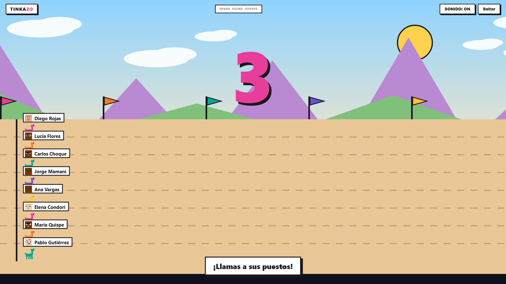

# Tinkazo 🦙

**Sorteos que nadie puede arreglar. Ni vos.**

En Bolivia, un *tinkazo* es esa corazonada de que hoy tenés suerte. Tinkazo sortea premios en eventos de comunidades: pegás la lista, sale el ganador en pantalla grande con una carrera de llamas o una ruleta, y cualquiera puede comprobar después que no hubo trampa.

🌐 **Probalo:** [tinkazo.vercel.app](https://tinkazo.vercel.app)



## El problema

Toda comunidad hace sorteos: libros, licencias, entradas, poleras. Y en todos hay alguien que piensa que el organizador le dio el premio a su amigo. Las herramientas que existen o cobran por algo trivial, o son gratis y el resultado es "confía en mí".

## Cómo funciona

1. **Traés la lista.** Pegás los nombres o subís un CSV. Los participantes no instalan nada ni se crean cuenta. Nunca.
2. **Se congela la lista.** Se calcula su huella (SHA-256) y se compromete contra una **ronda futura** de [drand](https://drand.love), el faro público de aleatoriedad de la League of Entropy. La clave está en el orden: cuando cerrás la lista, el número que va a decidir **todavía no existe**.
3. **Llega el número.** Diez segundos después, drand publica esa ronda firmada. Ni vos ni yo pudimos elegirla. Si el sorteo se ancla en Stellar la espera sube a cuarenta y cinco, porque el contrato exige treinta de margen y no se puede cambiar.
4. **El show.** Cinco juegos a pantalla completa, con narrador. Cuando arranca la animación el ganador ya está decidido: el juego solo lo cuenta.
5. **Cualquiera revisa.** El comprobante es un enlace. Quien lo abre ve la página rehacer el sorteo desde cero en su propio navegador y dar un veredicto.

Con una cuenta de Stellar conectada, el sello y el resultado quedan **registrados en un contrato**, que verifica la firma del faro por su cuenta. Ese registro sigue ahí aunque Tinkazo desaparezca.

## Qué hay construido

**El contrato `tinkazo-raffle`** ([contracts/raffle](contracts/raffle)), en Rust sobre Soroban. `seal` compromete la huella de la lista, la cantidad de participantes y una ronda futura, y exige que esa ronda nazca al menos treinta segundos después. `draw` verifica la firma BLS12-381 de la ronda **dentro de la cadena** con `pairing_check`, deriva la semilla y selecciona los ganadores.

Es inmutable: no tiene administrador ni actualización, y no custodia fondos. `draw` no pide permiso a nadie, así que el organizador no puede retener un resultado que no le gusta. 19 tests, incluida una ronda real de quicknet y vectores compartidos con la implementación en TypeScript. WASM de 11,4 KB.

**El sitio**, en Vite y TypeScript sin framework. Interfaz bilingüe, tema claro y oscuro, y tres formas de entrar: Freighter, Google vía Pollar, o una cuenta de prueba que el navegador crea y fondea solo.

**Seis juegos**, todos sembrados con la misma ronda de drand, así que la animación de un sorteo es reproducible:

| Juego | Qué es | Aguanta |
|---|---|---|
| Constelación Stellar | Un pago que salta de estrella en estrella buscando ruta, como un *path payment*. Deja dibujada una constelación. | 200 |
| Cierre de Libro | Tarjetas barridas por el cierre de un ledger hasta que queda una sellada. Dura lo que tarda Stellar en cerrar uno. | 200 |
| Carrera de llamas | Lo nuestro. Ocho carriles por la cordillera. | 8 en pantalla |
| Carrera de cohetes | La misma carrera, en el espacio. | 8 en pantalla |
| Pasanaku | El ahorro rotativo boliviano: un aguayo que se cierra sobre los bultos hasta que queda uno en el nudo. Los hilos entre vecinos son trustlines. | 200 |
| Ruleta | La de siempre, pero que se ve girar con dos personas. | 24 |

Ninguno decide nada: el ganador llega dado por el protocolo y el juego solo lo cuenta. Hay un auditor que lo comprueba en cada juego, con quince verificaciones. La que importa: el nombre en pantalla tiene que ser el que fijó el protocolo.

**El narrador habla.** Usa la voz del navegador, elige una en español de las que estén instaladas y sube el ritmo con la tensión. Si la máquina no tiene voz, el sorteo funciona igual.

**Y después del ganador aparece una tarjeta** que contesta la pregunta que el juego deja picando: por qué los rombos de la Constelación son anchors, si la red de Stellar alguna vez no pudo cerrar un libro, qué es un pasanaku. Dos frases y el enlace a la fuente primaria. Doce tarjetas, todas verificadas.

**La página de verificación**, que da uno de tres veredictos:

| Veredicto | Cuándo |
|---|---|
| 🟢 Verde | El contrato atestigua la huella de la lista. Cambiar un nombre se detecta. |
| 🟡 Amarillo | La cuenta cierra, pero el sorteo no quedó en la cadena: nadie más que el organizador puede confirmar que esa era la lista original. |
| 🔴 Rojo | Algo no cuadra, y dice qué. |

Ese amarillo es justo lo que compra anclar, y decirlo es más honesto que un verde fácil.

## Qué cuesta

Medido en testnet, no estimado. Con XLM a US$ 0,196:

| | XLM | US$ |
|---|---|---|
| Sellar un sorteo | 0,099 | 0,019 |
| Sortear (incluye la verificación BLS) | 0,083 | 0,016 |
| **Total por sorteo** | **0,18** | **0,036** |

La verificación criptográfica en sí cuesta 0,003 XLM. Es posible gracias a las funciones nativas de BLS12-381 que Stellar incorporó en [CAP-0059](https://github.com/stellar/stellar-protocol/blob/master/core/cap-0059.md). Casi todo el resto es alquiler de almacenamiento por 120 días. Detalle en [docs/deployments.md](docs/deployments.md).

**Verificar siempre es gratis.** Sortear en el navegador también.

## Sin servidor, a propósito

No hay backend ni base de datos. Las únicas dependencias en ejecución son el RPC de Stellar, los relays de drand y la wallet del organizador. No es una limitación temporal: es lo que permite decir que no hace falta confiar en nadie.

Dos consecuencias concretas. En la cadena viaja **solo la huella de la lista**, nunca los nombres. Y el comprobante viaja en el fragmento de la URL, esa parte después del numeral que **no se envía al servidor**: los nombres de tus participantes no llegan ni a los registros del hosting.

Esa disciplina se rompe fácil sin darse cuenta, y se rompió dos veces. El QR del comprobante se le pedía a un servicio ajeno, mandándole la URL entera. Y el avatar de cada participante se le pedía a otro, con el nombre de la persona en la dirección: con doscientos inscritos eran doscientas peticiones, cada una con el nombre de alguien real adentro. Los dos se dibujan acá ahora.

**Hoy la única petición que sale del navegador es la ronda del faro, y no lleva ningún nombre.** De paso, los avatares aparecen al instante y el QR funciona con el wifi del evento caído. Hay una comprobación que lee el QR con un lector independiente: `pnpm check:qr`. Lo que puede salir mal y qué lo impide está en [docs/amenazas.md](docs/amenazas.md).

## Correr en local

```bash
pnpm install
pnpm dev          # http://localhost:5173
pnpm test         # protocolo v2 contra vectores compartidos
pnpm build
```

El contrato necesita Rust con el target `wasm32v1-none`:

```bash
cargo test --workspace
cargo build --release --target wasm32v1-none -p tinkazo-raffle
```

Parámetros de URL útiles: `?lang=en`, `?theme=light|dark`, `?demo=stellar|ledger|pasanaku|race|rockets|wheel`, `?instant=1`, `?lead=3`.

Para auditar un juego: `node scripts/audit-game.mjs <juego>`.

## Estructura

```
index.html, verificar.html   Las dos páginas
src/protocol/                Lista canónica, selección, drand, comprobante
src/stellar/                 Red, wallets y cliente del contrato
src/games/                   Los cinco juegos y el andamiaje que comparten
contracts/raffle/            El contrato Soroban, en Rust
docs/                        Protocolo, PRD, arquitectura, épicas, juegos, despliegues
scripts/                     Despliegue, smoke test y auditor de juegos
```

## Documentación

- [Protocolo v2](docs/protocolo.md), la especificación normativa. Cualquiera puede reimplementarla y llegar al mismo resultado.
- [Juegos](docs/juegos.md), el contrato que cumple todo juego y las doce comprobaciones del auditor.
- [Despliegues](docs/deployments.md), direcciones por red y costos medidos.
- [Marca](docs/marca.md), paleta con los contrastes medidos, tipografía, cómo se escribe y qué no va. Para armar una presentación o un afiche.
- [Amenazas](docs/amenazas.md), qué puede salir mal, qué lo impide hoy y qué no. Incluye el único ataque conocido que sigue abierto.
- [PRD](docs/prd.md) · [Arquitectura](docs/architecture.md) · [Épicas](docs/epics.md)

## Estado

Funcionando en **testnet**, de punta a punta. Mainnet es el siguiente paso: cuesta unos 16 XLM desplegar y unos 49 al año de alquiler.

## Contribuir

Es código libre. Issues y pull requests son bienvenidos.

**Si encontrás una forma de arreglar un sorteo, abrí un issue.** Ese es el reporte que más sirve. Hay una conocida y documentada: un organizador podría sellar varias listas contra rondas distintas y publicar solo la que le conviene. La defensa es que todos los sellos son públicos bajo su dirección, y que el identificador del sorteo se anuncia antes de que exista la semilla.

Para agregar un juego, mirá [docs/juegos.md](docs/juegos.md): hay que pasar el auditor antes de entrar.

## Licencia

[MIT](LICENSE) © 2026 Nicolás Emir Mejía Agreda

---

## English

**Raffles nobody can rig. Not even you.**

In Bolivia, a *tinkazo* is that hunch that today is your lucky day. Tinkazo draws prizes at community events: paste the list, the winner comes out on the big screen with a llama race or a roulette, and anyone can check afterwards that it was clean.

Six full-screen games tell the result: a payment hopping star to star, a ledger close sweeping cards away, a Bolivian rotating savings circle, two races and a roulette. None of them decides anything. A narrator calls the draw out loud, and afterwards a card explains a piece of Stellar history with its primary source.

The list is sealed with SHA-256 and committed against a **future** round of the [drand](https://drand.love) public randomness beacon, so when you lock the list the number that decides doesn't exist yet. A Soroban contract on Stellar verifies that round's BLS12-381 signature **on chain** and derives the winner deterministically. Participants never need a wallet or an account.

A whole raffle costs **0.18 XLM**, about four cents. The cryptographic verification itself is 0.003 XLM, thanks to Stellar's native BLS12-381 host functions ([CAP-0059](https://github.com/stellar/stellar-protocol/blob/master/core/cap-0059.md)).

No backend, no database. The only runtime dependencies are Stellar RPC, drand relays and the organizer's wallet. Only the list fingerprint goes on chain, never the names.

Running on **testnet** end to end. Spec in [docs/protocolo.md](docs/protocolo.md) (Spanish). Live at [tinkazo.vercel.app](https://tinkazo.vercel.app) · MIT licensed.
