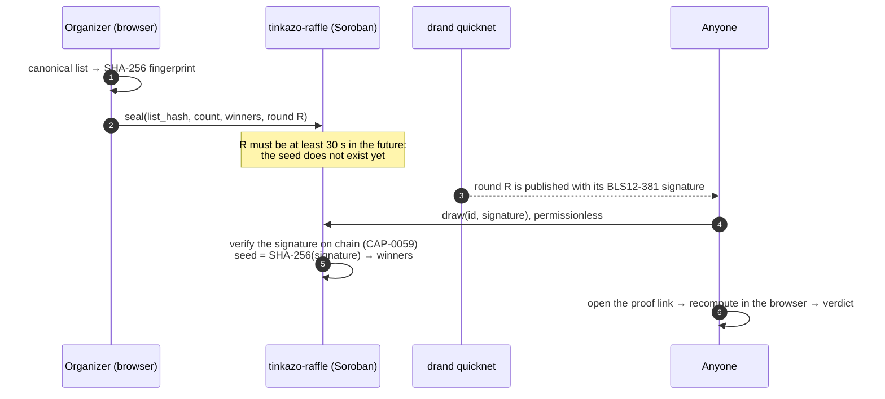
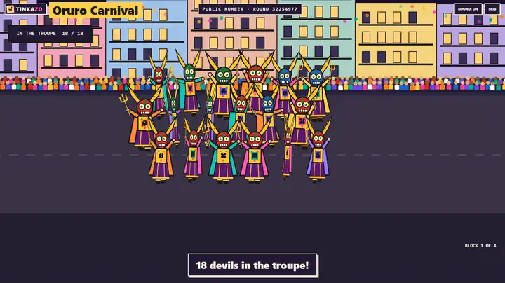

<div align="center">

# Tinkazo 🦙

### Verifiable draws for communities, sealed before the randomness exists and checked on Stellar.

[](https://tinkazo.vercel.app)
[](https://stellar.expert/explorer/testnet/contract/CD2SSHBU37BSPCLNB2XMOGRL3CLUAURIJAJSG2CZVFZRDTURSIDARENH)
[](https://github.com/nema1502/tinkazo/actions/workflows/ci.yml)
[](https://drand.love)
[](LICENSE)

**[Try it](https://tinkazo.vercel.app)** · [How it works](#how-it-works) · [Security](#security) · [Why Stellar](#why-stellar) · [What is live](#what-is-live-today) · [Next 30 days](#the-next-30-days) · [Español](README.es.md)


</div>

---

Every community gives things away: conference tickets, books, software licenses, scholarships, speaking slots, who presents first. And every time, someone in the room wonders whether the organizer picked a friend. The tools people use today are a spreadsheet `RAND()`, a spinning wheel on a website, or "trust me". None of them can be checked afterwards.

**Tinkazo makes the draw checkable by anyone, from their phone.** The organizer pastes a list, the list is sealed on Stellar, and the winner comes from a public random number that did not exist yet when the list was sealed. A Soroban contract verifies that number's signature on chain. The result is shown on the big screen as a full-screen game, and anyone can re-run the whole draw in their browser from a link.

Participants need nothing: no wallet, no account, no app.

The draw is where it starts. What Tinkazo is for is broader: whenever people share something out (a prize, a speaking slot, a grant, a spot on a trip), it should be fair, and anyone should be able to check it from their phone, without knowing there is a blockchain underneath.

## Not gambling

Tinkazo decides who gets something that is already being given away. It is not a way to bet or to sell chances:

- **Entering is free, always.** No tickets and no entry fees. The [terms](https://tinkazo.vercel.app/terminos.html) forbid using Tinkazo for draws that charge to take part.
- **Nobody can bet on the outcome.** There are no odds and no pot: nobody puts money in, so nobody wins anyone else's money.
- **The contract holds no funds.** It stores a list fingerprint and a result, nothing else.

A free draw with no purchase required stays outside gambling rules almost everywhere; the country-by-country research is in [docs/legal.md](docs/legal.md). A few identifiers in the contract still say *raffle* (`tinkazo-raffle`, `raffle_id`), from before the name settled. They are part of the deployed contract's interface, so they stay.

## How it works


```mermaid
sequenceDiagram
    autonumber
    participant O as Organizer (browser)
    participant C as tinkazo-raffle (Soroban)
    participant D as drand quicknet
    participant A as Anyone
    O->>O: canonical list → SHA-256 fingerprint
    O->>C: seal(list_hash, count, winners, round R)
    Note over C: R must be at least 30 s in the future:<br/>the seed does not exist yet
    D-->>A: round R is published with its BLS12-381 signature
    A->>C: draw(id, signature), permissionless
    C->>C: verify the signature on chain (CAP-0059)<br/>seed = SHA-256(signature) → winners
    A->>A: open the proof link → recompute in the browser → verdict
```

1. **Seal.** The list is canonicalized and hashed with SHA-256. The contract records the fingerprint, the head count, the number of winners and a **future** drand round. The contract refuses a round less than 30 seconds away.
2. **Wait for the number.** [drand](https://drand.love) quicknet, the public randomness beacon run by the League of Entropy (Cloudflare, Protocol Labs, EPFL and others), publishes a BLS-signed round every 3 seconds. Nobody, including the organizer and Tinkazo, can know or choose it in advance.
3. **Draw.** `draw` verifies the round's BLS12-381 signature **inside the contract** with a pairing check, derives the seed and selects the winners deterministically. It asks nobody for permission: if the organizer disappears mid-event, anyone can finalize the draw and the winner is the same.
4. **Show.** One of twelve full-screen games tells the result. The winner is already fixed when the animation starts; the game only narrates it.
5. **Verify.** The proof is a link. Whoever opens it watches the page recompute the draw from scratch and gets a verdict: green if the contract attests the list, yellow if the draw was not anchored, red with the reason if anything does not match.

The full selection algorithm is a normative spec, [Protocol v2](docs/protocolo.md) ([English translation](docs/protocol.en.md)), with test vectors shared by the Rust contract and the TypeScript client ([docs/vectors.json](docs/vectors.json)). Anyone can reimplement it and reach the same winners.

## Why Stellar

- **Verifying public randomness on chain is cheap here.** Stellar's native BLS12-381 host functions ([CAP-0059](https://github.com/stellar/stellar-protocol/blob/master/core/cap-0059.md)) let the contract check drand's signature itself. The verification costs **0.003 XLM**; a whole draw, seal plus draw, costs **0.76 XLM, about US$0.16**, measured on testnet on October 3, 2026, and almost all of it is storage rent ([breakdown](docs/deployments.md)).
- **No oracle to run.** The proof is drand's own signature, checkable against its public key years from now. There is no node to keep alive and no operator to trust.
- **Immutable and custody-free.** The contract has no admin, no upgrade path and holds no funds. A new version is a new address, recorded in [docs/deployments.md](docs/deployments.md).
- **Onboarding that works at a meetup.** Organizers sign in with Google through Pollar, which holds the key for them (the full flow with a real Google session is still being tested), with Freighter, or with a testnet account the browser creates and funds. Participants never touch Stellar at all.
- **Where it goes next is native to Stellar:** rewards and stipends in USDC that the organizer puts up and the person picked claims as a claimable balance, by signing in with Google ([design](docs/premios.md)). Participants never pay anything and Tinkazo never touches the money, so there is no pot and nothing to bet.

## What is live today

| Component | Status | Evidence |
|---|---|---|
| Soroban contract `tinkazo-raffle` | Deployed on testnet, which Stellar wipes on December 16, 2026 | [`CD2SSHBU…ARENH`](https://stellar.expert/explorer/testnet/contract/CD2SSHBU37BSPCLNB2XMOGRL3CLUAURIJAJSG2CZVFZRDTURSIDARENH) · 19 tests, including a real quicknet round · 11.4 KB WASM |
| Web app | Live | [tinkazo.vercel.app](https://tinkazo.vercel.app) · Spanish and English · light and dark · no backend |
| Luma import | Live | Drop the guest export and pick who gets in: those who checked in, the approved ones, or by hand |
| Verification page | Live | Recomputes any draw in the browser from its proof link |
| Twelve stadium games | Live | Deterministic: the same round draws the same frames on any machine |
| Protocol v2 | Specified | [docs/protocolo.md](docs/protocolo.md) ([in English](docs/protocol.en.md)) and shared vectors that both implementations must pass |
| Quality gates | In CI and in the repo | 196 TypeScript tests, the 19 contract tests, and seven custom auditors (below) |

Tested with a thousand participants: the draw still runs at 60 frames per second and anchors the same way.

**Who was actually in the room.** In the first real Luma export we tried, 67 people had registered and 35 checked in. Drawing from the whole export would have handed half the chances to people who were not there. The import window proposes those who checked in, says who is left out and why (didn't come, pending, invited, declined), and lets the organizer tick someone who came but was never checked in. The file never leaves the browser, and only names go into the draw.

<div align="center">

</div>

<div align="center">

</div>

## The show

Fairness is math; the show is what makes a room care. Twelve games, most of them rooted in Bolivian and Latin American culture, each seeded with the same drand round, so a draw's animation is reproducible:

| Game | What it is |
|---|---|
| Stellar Constellation | A payment hops from star to star looking for a route, like a path payment, and leaves a constellation drawn |
| Llama Race | Eight lanes across the Andes |
| Red Light, Green Light | The playground game: on green everyone runs, on red the Lighthouse turns around and sweeps the field with its beam, and anyone it catches moving sits down |
| Aguayo | The Andean carrying cloth: everyone's bundle sits on it, the cloth closes and ties up, and the one left goes off in the knot |
| Cable Car | Cabins in the colors of the La Paz and El Alto lines climb the cable; half the riders get off at each station |
| Ball Drum | The fair's drum, one numbered ball per person on the sealed list |
| Wheel | The classic, readable even with two people |
| Spinning Tops | The schoolyard game: tops thrown into a chalk ring clash and knock each other out, down to a head-to-head |
| Piñata | The seven-pointed star from the posadas: every swing knocks names out, and the last candy inside wins |
| Oruro Carnival | A Diablada troupe dances block by block toward the Socavón; a few stay at every arch |
| Sapo | The frog toss from fairs and patios: a hole for each name around the frog; rings hit, dance on a rim and roll out, and the last one drops into the winner's |
| Who Is It? | Everyone on a card; each turn a letter flips the ones that don't match, until one is left |

**None of them decides anything.** An *emotion director* writes each draw's story from the same round: in the race a llama stops dead, another trips and two spit at each other; the wheel stops on someone else and then slips one more slice; in the cable car the power goes out mid-air. The ending cannot be guessed, and an auditor checks across sixteen seeds per game that the story does not give the winner away.

A camera director frames every game like a broadcast: it follows the leader, pushes in on the scare, slows down for the photo finish and shakes on impact. The games run on PixiJS, and where a device has no WebGL the previous engine takes over, so a draw never goes blank.

Andean music with a beat plays in the background and follows the tension, short captions call each moment on screen, and after the winner a card explains a piece of the story with its primary source.

## Security

> **The number that decides the draw does not exist when the list is closed, and a contract on Stellar verifies it.** What stays open is not technology, it is people: that is why everything is shown before that number exists.

**What is closed**

| Risk | Why it can't happen |
|---|---|
| Choosing the winning number | The round is fixed before it exists, at least thirty seconds ahead, and its signature is verified on chain |
| Changing the list after sealing | The fingerprint changes, and the one that counts was recorded before the seed |
| Withholding an unwanted result | `draw` is permissionless: anyone can finalize it, and the winner is the same |
| Drawing twice | The contract keeps the first result and rejects another |
| A game showing another winner | Games receive the winner already decided, and an auditor checks it in all twelve |
| Taking over the contract | It has no admin, it can't be upgraded and it holds no funds |

**What stays open, and what stands against it**

| Risk | What there is |
|---|---|
| **Building the list wrong** before sealing: a name twice, someone missing | "Show the list to the room": the list on the projector with duplicates flagged and a QR so everyone can find themselves on their phone. The receipt has the same search box, and the Luma import proposes only those who checked in |
| **Sealing several times** and publishing the convenient result | The draw number is shown big during the wait, so it ends up in the photos. The verification flags repeated seals from the account and the same list sealed from another |
| **A fake site** on the projector | What counts is the contract, and a fake site can't write to it. The draw can be checked on stellar.expert and with drand's public round, [without going through Tinkazo](https://tinkazo.vercel.app/como-funciona.html#sin-nosotros) |

For mainnet: one open draw per account, public cancellation, the round set by the contract and a sorted list in the protocol. The full STRIDE analysis is in [docs/amenazas.md](docs/amenazas.md) ([summary in English](docs/threat-model.en.md)), and the plain-language version on the [security page](https://tinkazo.vercel.app/seguridad.html).

**Privacy.** Only the fingerprint goes on chain, never the names. The proof travels in the URL fragment, which browsers do not send to servers.

## How it compares

Randomness from drand on Stellar is already solved more than once, and it is worth naming who solved it:

| | Spreadsheet or wheel website | [Stellar-VRF](https://github.com/NibrasD/Stellar-VRF) | [Drand-Relay](https://github.com/kaankacar/Drand-Relay) | Tinkazo |
|---|---|---|---|---|
| What it is | A button | An oracle: a contract asks, an off-chain worker delivers the round | A relay that posts drand rounds and a contract that verifies them | A draw for an organizer and a room |
| Who can verify | Nobody | Anyone reading the chain | Anyone reading the chain | Anyone with the link, from a phone |
| Infrastructure to run | None | The oracle worker | The feeder that posts rounds | None: the browser builds the transaction |
| Built for | Anyone, unverifiable | Other contracts | Other contracts | People who run giveaways |

All three verify drand quicknet's BLS signature on chain with CAP-0059. Stellar-VRF and Drand-Relay are primitives for other contracts, and good ones. Tinkazo is the end-user product on top of the same idea: a list committed before the seed exists, a `draw` anyone can trigger, and a proof page that runs on a phone. Off chain, [Wallop](https://wallop.run) does commit and drand for draws without a ledger.

That is why Tinkazo does not publish yet another verifier crate. Its on-chain check, [`drand.rs`](contracts/raffle/src/drand.rs), is 112 lines; what the ecosystem is asking for is a guide that compares the approaches ([stellar-docs#2874](https://github.com/stellar/stellar-docs/issues/2874)), and that is in the plan below.

## Costs

Measured on testnet on October 3, 2026, not estimated: what the network charged, per Horizon. XLM at US$0.215.

| | XLM | US$ |
|---|---|---|
| Seal a draw | 0.42 | 0.090 |
| Draw, including BLS verification | 0.34 | 0.074 |
| **Total per draw** | **0.76** | **0.16** |
| Mainnet: deploy once (September 16 projection) | about 16 | about 3 |
| Mainnet: keep the contract alive (same) | about 49 a year | about 10 a year |

Almost all of the cost is storage rent, and the network sets that rate: on September 16 the same contract paid 0.18 XLM per draw, and in three weeks testnet rent quadrupled it. The BLS verification itself costs 0.003 XLM. Mainnet gets measured at deploy time. **Verifying is always free.**

## Quality

Seven auditors in [`scripts/`](scripts) run the real site in headless Chrome:

- **Game auditor**, 20 checks per game against live drand. The one that matters: the name on screen is the one the protocol fixed.
- **Strict auditor**, which swaps the browser clock to compare two runs frame by frame: same round, same frames, no `Math.random`, never four seconds without something happening, a readable winner plate from the back of the room, with two people and with two hundred, on a phone.
- **Emotion auditor**, sixteen seeds per game: the story arcs vary and the winner's mid-race position does not give it away.
- **Sound auditor**, which hooks every oscillator and measures the effects' pitch, register, volume and gaps, with the music counted apart.
- **UI auditor**, desktop and phone, both themes: broken images, clipped text, contrast, tap targets.
- **Physics auditor**, for the ball drum and the aguayo: nobody overlaps, nobody escapes, and the same round gives the same bounces.
- **Collision auditor**, for the spinning tops: every hit really touches, with action and reaction, and nobody passes through anybody.

## The next 30 days

Four deliverables, each with a check anyone can run from outside:

| Deliverable | Done when |
|---|---|
| Mainnet, with the fee covered and a verified build (`pnpm preflight:mainnet` already checks the rest) | The contract shows as verified on stellar.expert, and an organizer who signed in with Google, holding 0 XLM, seals and draws a draw that verifies green |
| Five real draws, at least three run by someone else with their own account | Five green proof links on mainnet, five organizer addresses, and a short note from each organizer |
| An organizer kit, in English and Spanish | A one-page guide, the generated rules and a results text for Luma with each participant's proof, linked from the site |
| Randomness on Soroban, three approaches measured | A write-up comparing [Drand-Relay](https://github.com/kaankacar/Drand-Relay), [Stellar-VRF](https://github.com/NibrasD/Stellar-VRF) and Tinkazo's on-demand check (cost, trust assumptions, a sample contract), offered to [stellar-docs#2874](https://github.com/stellar/stellar-docs/issues/2874) |

After that: USDC rewards as claimable balances, put up by the organizer and claimed by signing in with Google, first on testnet. Participants will still pay nothing, and Tinkazo never touches the money.

## Run it locally

```bash
pnpm install
pnpm dev          # http://localhost:5173
pnpm test         # protocol v2 against the shared vectors
pnpm build
```

The contract needs Rust with the `wasm32v1-none` target:

```bash
cargo test --workspace
cargo build --release --target wasm32v1-none -p tinkazo-raffle
```

Useful URL parameters: `?lang=en`, `?theme=light|dark`, `?demo=race|luz|trompo|pinata|oruro|tombola|wheel|teleferico|pasanaku|stellar|sapo|quien`, `?instant=1`, `?pose=1` and `?motor=clasico` (the previous engine).

## Repository

```
index.html · verificar.html     The landing and the tool, and the page that re-runs a draw from its proof
lista.html                      The list to review before sealing, on everyone's phone
src/protocol/                   Canonical list, selection, drand, proof
src/stellar/                    Network, wallets and contract client
src/games/                      The twelve games and the scaffolding they share
contracts/raffle/               The Soroban contract, in Rust
docs/                           Protocol, architecture, threats, deployments, legal, games
scripts/                        Deployment, smoke test and the auditors
```

In English: the [protocol](docs/protocol.en.md) and a [threat model summary](docs/threat-model.en.md). The rest of the documentation is in Spanish: [protocol](docs/protocolo.md) · [architecture](docs/architecture.md) · [threats](docs/amenazas.md) · [deployments and costs](docs/deployments.md) · [games](docs/juegos.md) · [legal](docs/legal.md) · [brand](docs/marca.md).

## Team

Built in Bolivia by [Nicolás Emir Mejía Agreda](https://github.com/nema1502). The name is Bolivian: a *tinkazo* is a hunch, a gut feeling.

## Contributing

Issues and pull requests are welcome. **If you find a way to skew a draw, open an issue**: it is the most useful report there is. To add a game, read [docs/juegos.md](docs/juegos.md); it has to pass the auditors to get in.

## License

[MIT](LICENSE) © 2026 Nicolás Emir Mejía Agreda
