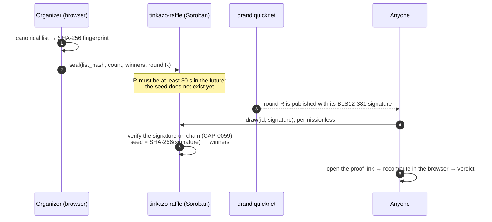

<div align="center">

# Tinkazo 🦙

### Provably fair draws for communities, sealed before the randomness exists and verified on Stellar.

[](https://tinkazo.vercel.app)
[](https://stellar.expert/explorer/testnet/contract/CD2SSHBU37BSPCLNB2XMOGRL3CLUAURIJAJSG2CZVFZRDTURSIDARENH)
[](https://github.com/nema1502/tinkazo/actions/workflows/ci.yml)
[](https://drand.love)
[](LICENSE)

**[Try it](https://tinkazo.vercel.app)** · [How it works](#how-it-works) · [Why Stellar](#why-stellar) · [What is live](#what-is-live-today) · [Roadmap](#roadmap) · [Español](README.es.md)


</div>

---

Every community gives things away: conference tickets, books, software licenses, scholarships, speaking slots, the turn order of a rotating savings circle. And every time, someone in the room wonders whether the organizer picked a friend. The tools people use today are a spreadsheet `RAND()`, a spinning wheel on a website, or "trust me". None of them can be checked afterwards.

**Tinkazo makes the draw checkable by anyone, from their phone, forever.** The organizer pastes a list, the list is sealed on Stellar, and the winner comes from a public random number that did not exist yet when the list was sealed. A Soroban contract verifies that number's signature on chain. The result is shown on the big screen as a full-screen game with a narrator, and anyone can re-run the whole draw in their browser from a link.

Participants need nothing: no wallet, no account, no app.

## Not gambling

Tinkazo decides who gets something that is already being given away. It is not a way to bet or to sell chances:

- **Entering is free, always.** No tickets and no entry fees. The [terms](https://tinkazo.vercel.app/terminos.html) forbid using Tinkazo for draws that charge to take part.
- **Nobody can bet on the outcome.** There are no odds and no pot: nobody puts money in, so nobody wins anyone else's money.
- **The contract holds no funds.** It stores a list fingerprint and a result, nothing else.

A free draw with no purchase required stays outside gambling rules almost everywhere; the country-by-country research is in [docs/legal.md](docs/legal.md). A few identifiers in the contract still say *raffle* (`tinkazo-raffle`, `raffle_id`), from before the name settled. They are part of the deployed contract's interface, so they stay.

## How it works


```mermaid
sequenceDiagram
    autonumber
    participant O as Organizer (browser)
    participant C as tinkazo-raffle (Soroban)
    participant D as drand quicknet
    participant A as Anyone
    O->>O: canonical list → SHA-256 fingerprint
    O->>C: seal(list_hash, count, winners, round R)
    Note over C: R must be at least 30 s in the future:<br/>the seed does not exist yet
    D-->>A: round R is published with its BLS12-381 signature
    A->>C: draw(id, signature), permissionless
    C->>C: verify the signature on chain (CAP-0059)<br/>seed = SHA-256(signature) → winners
    A->>A: open the proof link → recompute in the browser → verdict
```

1. **Seal.** The list is canonicalized and hashed with SHA-256. The contract records the fingerprint, the head count, the number of winners and a **future** drand round. The contract refuses a round less than 30 seconds away.
2. **Wait for the number.** [drand](https://drand.love) quicknet, the public randomness beacon run by the League of Entropy (Cloudflare, Protocol Labs, EPFL and others), publishes a BLS-signed round every 3 seconds. Nobody, including the organizer and Tinkazo, can know or choose it in advance.
3. **Draw.** `draw` verifies the round's BLS12-381 signature **inside the contract** with a pairing check, derives the seed and selects the winners deterministically. It asks nobody for permission: if the organizer disappears mid-event, anyone can finalize the draw and the winner is the same.
4. **Show.** One of eight full-screen games tells the result. The winner is already fixed when the animation starts; the game only narrates it.
5. **Verify.** The proof is a link. Whoever opens it watches the page recompute the draw from scratch and gets a verdict: green if the contract attests the list, yellow if the draw was not anchored, red with the reason if anything does not match.

The full selection algorithm is a normative spec, [Protocol v2](docs/protocolo.md), with test vectors shared by the Rust contract and the TypeScript client ([docs/vectors.json](docs/vectors.json)). Anyone can reimplement it and reach the same winners.

## Why Stellar

- **Verifying public randomness on chain is cheap here.** Stellar's native BLS12-381 host functions ([CAP-0059](https://github.com/stellar/stellar-protocol/blob/master/core/cap-0059.md)) let the contract check drand's signature itself. The verification costs **0.003 XLM**; a whole draw, seal plus draw, costs **0.18 XLM, about US$0.04**, measured on testnet ([breakdown](docs/deployments.md)).
- **No oracle to run.** The proof is drand's own signature, checkable against its public key years from now. There is no node to keep alive and no operator to trust.
- **Immutable and custody-free.** The contract has no admin, no upgrade path and holds no funds. A new version is a new address, recorded in [docs/deployments.md](docs/deployments.md).
- **Onboarding that works at a meetup.** Organizers sign in with Google through a Pollar smart wallet, with Freighter, or with a testnet account the browser creates and funds. Participants never touch Stellar at all.
- **Where it goes next is native to Stellar:** prizes paid in USDC as claimable balances, so the winner claims when ready without the organizer holding anything for them ([design](docs/premios.md)). The organizer funds the prize; participants never pay anything, so there is no pot and nothing to bet.

## What is live today

| Component | Status | Evidence |
|---|---|---|
| Soroban contract `tinkazo-raffle` | Deployed on testnet | [`CD2SSHBU…ARENH`](https://stellar.expert/explorer/testnet/contract/CD2SSHBU37BSPCLNB2XMOGRL3CLUAURIJAJSG2CZVFZRDTURSIDARENH) · 19 tests, including a real quicknet round · 11.4 KB WASM |
| Web app | Live | [tinkazo.vercel.app](https://tinkazo.vercel.app) · Spanish and English · light and dark · no backend |
| Verification page | Live | Recomputes any draw in the browser from its proof link |
| Eight stadium games | Live | Deterministic: the same round draws the same frames on any machine |
| Protocol v2 | Specified | [docs/protocolo.md](docs/protocolo.md) and shared vectors that both implementations must pass |
| Quality gates | In CI and in the repo | 76 unit tests, contract tests, and five custom auditors (below) |

Tested with a thousand participants: the draw still runs at 60 frames per second and anchors the same way.

<div align="center">

</div>

## The show

Fairness is math; the show is what makes a room care. Eight games, each seeded with the same drand round, so a draw's animation is reproducible:

| Game | What it is |
|---|---|
| Stellar Constellation | A payment hops from star to star looking for a route, like a path payment, and leaves a constellation drawn |
| Ledger Close | Cards are swept away by ledger closes until one stays sealed |
| Llama Race | Eight lanes across the Andes |
| Rocket Race | The same race, in space |
| Pasanaku | Bolivia's rotating savings circle: a woven cloth closes over the bundles until one is left in the knot |
| Cable Car | Cabins in the colors of the La Paz and El Alto lines climb the cable; half the riders get off at each station |
| Ball Drum | The fair's drum, one numbered ball per person on the sealed list |
| Wheel | The classic, readable even with two people |

**None of them decides anything.** An *emotion director* writes each draw's story from the same round: in the race a llama stops dead, another trips and two spit at each other; the wheel stops on someone else and then slips one more slice; in the cable car the power goes out mid-air. The ending cannot be guessed, and an auditor checks across sixteen seeds per game that the story does not give the winner away.

A camera director frames every game like a broadcast: it follows the leader, pushes in on the scare, slows down for the photo finish and shakes on impact. The games run on PixiJS, and where a device has no WebGL the previous engine takes over, so a draw never goes blank.

A narrator calls the big moments out loud (in Microsoft Edge it picks a neural Bolivian voice), an optional music mode plays Andean music with a beat that follows the tension, and after the winner a card explains a piece of the story with its primary source.

## Trust model

What is guaranteed, and what is not, is written down in [docs/amenazas.md](docs/amenazas.md) and on the [security page](https://tinkazo.vercel.app/seguridad.html).

- **Adding a name after sealing** changes the fingerprint, and the fingerprint that counts was recorded before the seed existed.
- **Choosing the number** is impossible: the round is fixed before it is published, and its signature is verified on chain.
- **Withholding an unwanted result** does not work: `draw` is permissionless.
- **The one known open attack** is commitment selection: sealing the same list against several rounds and publishing only the convenient one. Every seal is public under the organizer's address, and the verification page flags repeated fingerprints on its own. Publishing the draw's rules before the round exists (the app generates them) closes most of the gap.
- **Privacy.** Only the fingerprint goes on chain, never the names. The proof travels in the URL fragment, which browsers do not send to servers. During a draw, the only outbound request is the drand round.

## How it compares

| | Spreadsheet or wheel website | Oracle-based VRF service | Tinkazo |
|---|---|---|---|
| Who can verify | Nobody | Consumers of the oracle | Anyone with the link, from a phone |
| What must be trusted | The organizer | The oracle operator | drand's public key and the contract code |
| Infrastructure to run | None | An off-chain oracle node | None: the browser builds the transaction |
| Commits to the full list | No | No, to a seed | Yes, SHA-256 of the canonical list before the seed exists |
| Built for | Anyone, unverifiable | Other contracts | Organizers and a live audience |

VRF oracles are a primitive for other contracts. Tinkazo is the end-user product for the moment where fairness matters and a room is watching the screen.

## Costs

Measured on testnet, not estimated. XLM at US$0.196.

| | XLM | US$ |
|---|---|---|
| Seal a draw | 0.099 | 0.019 |
| Draw, including BLS verification | 0.083 | 0.016 |
| **Total per draw** | **0.18** | **0.036** |
| Mainnet: deploy once | about 16 | about 3 |
| Mainnet: keep the contract alive | about 49 a year | about 10 a year |

Most of each fee is storage rent for 120 days. **Verifying is always free**, and so is drawing without anchoring.

## Quality

Five auditors in [`scripts/`](scripts) run the real site in headless Chrome:

- **Game auditor**, 20 checks per game against live drand. The one that matters: the name on screen is the one the protocol fixed.
- **Strict auditor**, which swaps the browser clock to compare two runs frame by frame: same round, same frames, no `Math.random`, never four seconds without something happening, a readable winner plate from the back of the room, with two people and with two hundred, on a phone.
- **Emotion auditor**, sixteen seeds per game: the story arcs vary and the winner's mid-race position does not give it away.
- **Sound auditor**, which hooks every oscillator and measures pitch, register, volume, gaps and a narrator that trips over itself.
- **UI auditor**, desktop and phone, both themes: broken images, clipped text, contrast, tap targets.

## Roadmap

Each step has a success criterion that can be checked from outside.

| Step | Done when |
|---|---|
| Mainnet deployment (`pnpm preflight:mainnet` already checks everything else) | The contract is live on mainnet and a first draw verifies green from its link |
| Ten draws with real communities | Ten meetups, hackathons or classrooms, each with a public on-chain proof |
| USDC prizes as claimable balances, funded by the organizer | A winner signs in with Google and claims USDC on testnet, then on mainnet; participants still pay nothing |
| Event import and announcements | Luma CSV with check-in filter (done) plus a results message with each participant's proof |
| New rendering engine | All eight games on PixiJS at 60 fps on a mid-range phone, passing the same auditors (on desktop: done, 20/20 on the strict auditor at 60 fps; the phone measurement is next) |

## Run it locally

```bash
pnpm install
pnpm dev          # http://localhost:5173
pnpm test         # protocol v2 against the shared vectors
pnpm build
```

The contract needs Rust with the `wasm32v1-none` target:

```bash
cargo test --workspace
cargo build --release --target wasm32v1-none -p tinkazo-raffle
```

Useful URL parameters: `?lang=en`, `?theme=light|dark`, `?demo=stellar|ledger|pasanaku|teleferico|tombola|race|rockets|wheel`, `?instant=1`, `?pose=1` and `?motor=clasico` (the previous engine).

## Repository

```
index.html · verificar.html     The tool, and the page that re-runs a draw from its proof
src/protocol/                   Canonical list, selection, drand, proof
src/stellar/                    Network, wallets and contract client
src/games/                      The eight games and the scaffolding they share
contracts/raffle/               The Soroban contract, in Rust
docs/                           Protocol, architecture, threats, deployments, legal, games
scripts/                        Deployment, smoke test and the auditors
```

Documentation is in Spanish: [protocol](docs/protocolo.md) · [architecture](docs/architecture.md) · [threats](docs/amenazas.md) · [deployments and costs](docs/deployments.md) · [games](docs/juegos.md) · [legal](docs/legal.md) · [brand](docs/marca.md).

## Team

Built in Bolivia by [Nicolás Emir Mejía Agreda](https://github.com/nema1502). The name is Bolivian: a *tinkazo* is the hunch that today is your lucky day.

## Contributing

Issues and pull requests are welcome. **If you find a way to rig a draw, open an issue**: it is the most useful report there is. To add a game, read [docs/juegos.md](docs/juegos.md); it has to pass the auditors to get in.

## License

[MIT](LICENSE) © 2026 Nicolás Emir Mejía Agreda
