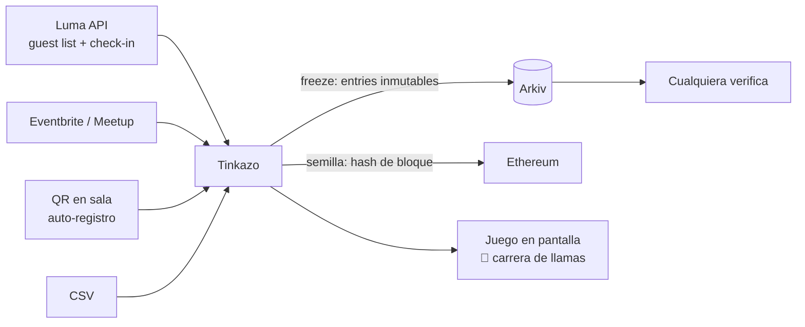

# Tinkazo, sorteos verificables y juegos para comunidades

**Track:** Open Lane (todo agosto, "game state, provenance") · **Autor:** Nicolás Emir Mejía Agreda (Bolivia)

> En Bolivia, un *tinkazo* es esa corazonada de que hoy tienes suerte. **Tinkazo** es la plataforma de sorteos
> para comunidades donde la suerte es divertida de ver (juegos) e imposible de arreglar (Arkiv).

## 1. El problema

Toda comunidad hace sorteos: libros, licencias, entradas, swag. Hoy tienen dos opciones malas:

1. **Herramientas de pago** (ruletas, carreras de patos) que cobran por algo trivial y donde el resultado es "confía en mí".
2. **Herramientas gratis cutres** donde además nadie puede verificar que el organizador no borró/agregó participantes a último minuto.

Y el dolor operativo real: **cargar a los participantes es un martirio**. Copiar nombres del chat, pasar lista a mano, transcribir de una hoja. Ahí es donde los sorteos se arruinan y donde nadie te resuelve.

## 2. La solución

Tinkazo tiene tres piezas:

1. **Importación sin fricción:** conecta el evento de Luma (API de guest list), Eventbrite o Meetup y los asistentes con check-in entran al sorteo automáticamente. Alternativas: QR en pantalla para auto-registro en sala, o CSV. Nadie transcribe nombres nunca más.
2. **Sorteo verificable:** al cerrar inscripciones, la lista queda **congelada como entidades en Arkiv** (inmutable, con timestamp). La semilla aleatoria es el hash de un bloque futuro de Ethereum, ni el organizador ni Tinkazo pueden manipular el resultado, y cualquiera puede re-computarlo.
3. **Juegos como show:** el resultado ya está determinado por la semilla; el juego es la *presentación teatral*. Catálogo: carrera de llamas 🦙 (nuestra respuesta a los patos), ruleta, batalla de avatares generados por IA a partir de la foto de perfil de cada participante, carrera de teleféricos paceños. El juego es skin; la verdad está en la chain.

## 3. Esquema de entidades

| Entidad | Anotaciones indexadas | Payload | BTL |
|---|---|---|---|
| `Raffle` | `type="raffle"`, `community`, `event_id`, `status` (open/frozen/drawn), `seed_block` | premio(s), reglas, juego elegido, fuente de participantes (luma/qr/csv) | 6 meses |
| `Entry` | `type="entry"`, `raffle_id`, `participant_hash` | nombre/alias (o hash si hay privacidad), origen (luma/qr), timestamp de check-in | 6 meses |
| `Draw` | `type="draw"`, `raffle_id`, `winner_entry` | hash del bloque-semilla, algoritmo (determinista, público), lista de ganadores por premio | 1 año, evidencia |
| `CommunityStats` | `type="stats"`, `community` | sorteos realizados, participantes históricos | Renovable |

**Invariante clave:** una vez `status="frozen"`, no se pueden crear más `Entry` para ese raffle (el freeze registra el `count` exacto). Cualquier auditor verifica: entradas ≤ timestamp de freeze, ganador = f(seed_block_hash, entradas ordenadas).

## 4. Queries

| Feature | Query |
|---|---|
| Lista congelada que ve el público | `type="entry" && raffle_id=R` + `count` (debe coincidir con el freeze) |
| Verificar un sorteo pasado | `type="draw" && raffle_id=R` → recomputar con la semilla pública |
| Historial de transparencia de una comunidad | `type="raffle" && community="pycon-bo" && status="drawn"` |
| "¿Ya estoy inscrito?" (participante) | `type="entry" && raffle_id=R && participant_hash=H` |
| Panel del organizador multi-evento | `type="raffle" && community=C && status="open"` |

## 5. ¿Por qué Arkiv?

- **La lista congelada es el producto.** Un sorteo es un problema de confianza sobre un registro temporal: exactamente lo que una entidad inmutable con timestamp resuelve y una DB editable no puede prometer.
- **BTL nativo:** las entradas expiran solas a los 6 meses, cero basura acumulada, y el costo del sorteo es centavos porque pagas por dato × tiempo.
- **Verificación permissionless:** el participante escéptico no necesita cuenta ni permiso para auditar, query pública y listo.
- Los participantes **no necesitan wallet** (se registran vía Luma/QR); solo la comunidad organizadora tiene wallet. Web3 invisible = adopción real.

## 6. Integración con Luma (y amigas)

Luma expone la guest list y el estado de check-in vía API: Tinkazo puede ofrecer "sortea solo entre los que SÍ vinieron", que es lo que todo organizador quiere y ninguna ruleta gratuita hace. (SerpApi entra opcional: Google Events para descubrir eventos/comunidades a las que ofrecerles Tinkazo, motor de growth, no de producto.)

**Identidad (Clerk):** el organizador entra a su dashboard con Google vía [Clerk](https://clerk.com), la wallet comunitaria que firma en Arkiv queda custodiada por la app y mapeada a su cuenta. Los participantes **jamás crean cuenta**: entran por Luma, QR o CSV. Fricción cero en ambos lados.

## 7. Modelo de negocio 💰

| Tier | Qué incluye | Precio |
|---|---|---|
| **Gratis** | 1 juego básico (ruleta), hasta 50 participantes, verificación completa (la confianza nunca es de pago) | $0 |
| **Comunidad** | Catálogo completo de juegos, Luma/Eventbrite, sin límite de participantes | ~$5/sorteo o suscripción |
| **Sponsor mode** | El sorteo se brandea con el sponsor del evento ("Sorteo cortesía de X"), avatares IA temáticos | El sponsor paga, la comunidad no |
| **White label** | Conferencias grandes y empresas, juegos custom | Licencia |

La jugada: **la verificación es gratis siempre** (eso construye la marca "sorteos que no se pueden arreglar"); se cobra por el *show* (juegos, branding, escala). Los sponsors son el cliente ideal: ya pagan por visibilidad en eventos y un sorteo brandeado es el momento de máxima atención del evento.

## 8. Encaje con la rúbrica

- **Track (20):** Open Lane pide "game state, provenance", Tinkazo es game state con provenance como propuesta de valor.
- **Arkiv fit (20):** inmutabilidad = anti-fraude, BTL = higiene y costo, lectura pública = verificación permissionless.
- **Datos y queries (20):** esquema mínimo (4 entidades) con un invariante verificable elegante.
- **Impacto (15):** toda comunidad del mundo hace sorteos; el dolor (carga de participantes + desconfianza) es universal y cotidiano.
- **Factibilidad (15):** Luma API + hash de bloque + frontend con juegos; el MVP es una semana de trabajo.
- **Originalidad (10):** nadie combina "carrera de llamas" con "auditable on-chain" 🦙⛓️.
